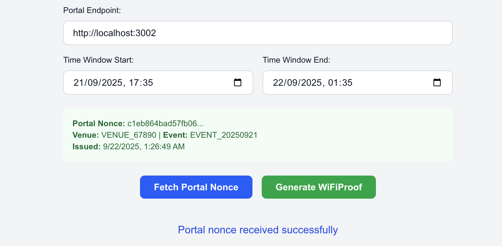
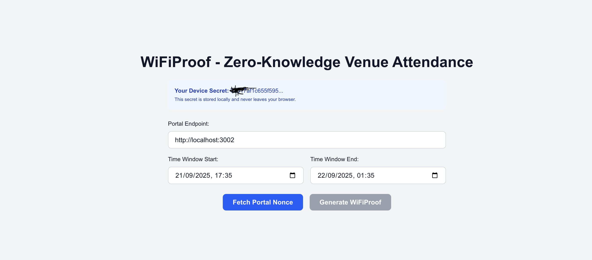
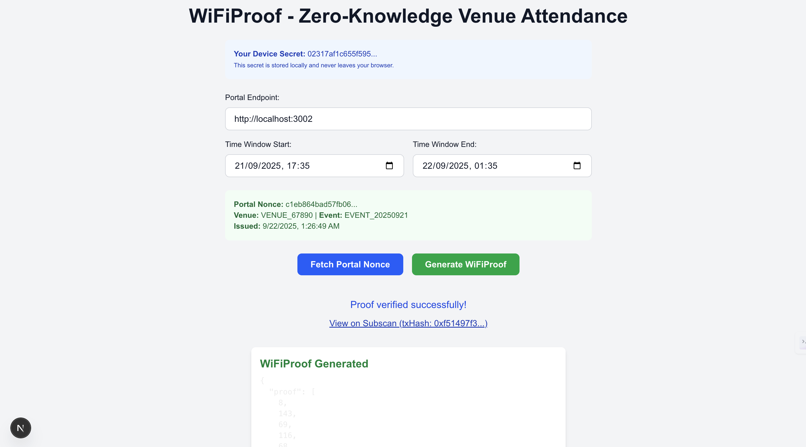
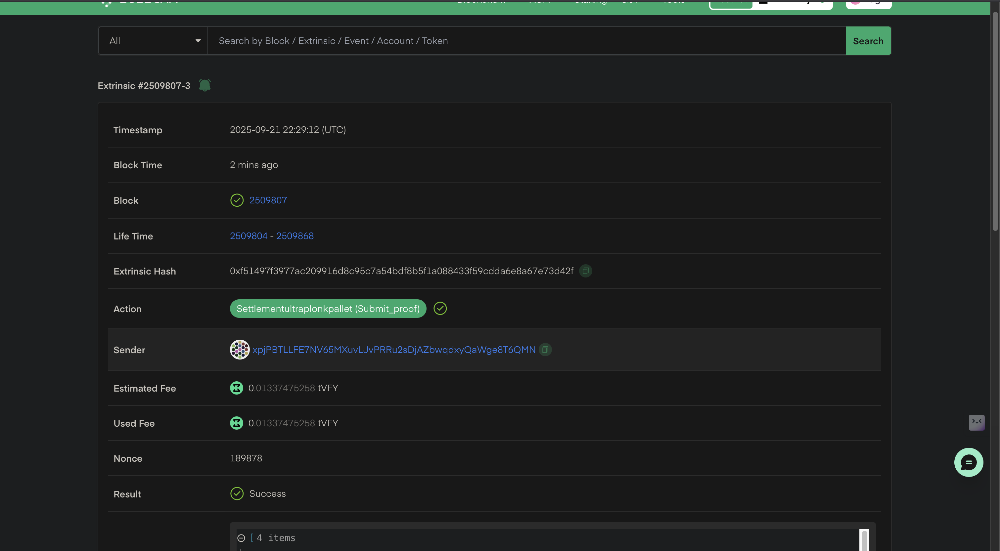
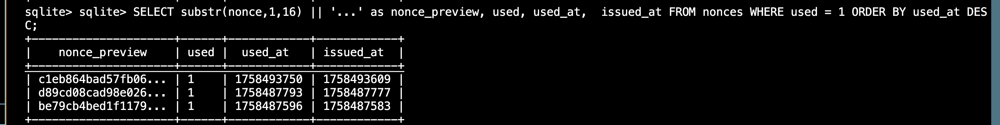
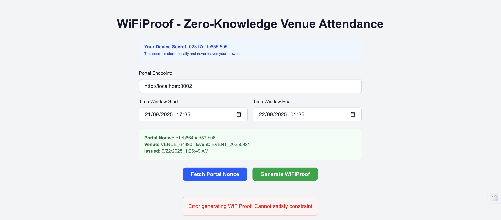
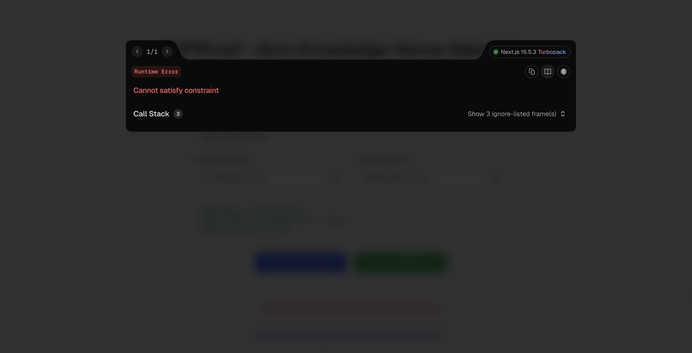

# WiFiProof: Zero-Knowledge Venue Attendance System

Privacy-preserving proof of attendance using WiFi connection data and Zero-Knowledge cryptography.

> **Note**: This is WiFiProof V1 - a proof-of-concept demonstrating device-based venue attendance verification. Based on extensive community feedback, we've identified key limitations and are developing V2 with enhanced security. See [V2 Roadmap](#v2-roadmap).

## Table of Contents
- [Overview](#overview)
- [How It Works](#how-it-works)
- [Blockchain Integrations](#blockchain-integrations)
- [V1 Limitations](#v1-limitations)
- [System Architecture](#system-architecture)
- [Quick Start](#quick-start)
- [Demo Walkthrough](#demo-walkthrough)
- [Configuration](#configuration)
- [V2 Roadmap](#v2-roadmap)
- [Technical Details](#technical-details)
- [Use Cases](#use-cases)

## Overview

### The Problem

At every blockchain and crypto event, attendees immediately ask for the WiFi password and stay connected throughout. This universal behavior could serve as cryptographic proof of attendance.

Current proof-of-attendance systems have significant limitations:
- **Sign-in sheets**: Easily forgeable
- **NFT tickets**: Transferable to non-attendees
- **Photos**: Can be faked or shared
- **Check-ins**: Require centralized trust
- **Privacy violations**: Most systems expose personal data

### The Solution

WiFiProof transforms WiFi connectivity into unforgeable cryptographic evidence of physical presence while preserving user privacy through Zero-Knowledge proofs.

**Core Features**:
- Real Zero-Knowledge Proofs (Noir circuits + Barretenberg cryptography)
- Privacy-First (user secrets never leave device)
- Replay Protection (single-use nonces)
- Physical Presence Enforcement (portal nonce system)
- Multi-Chain Support (zkVerify, Base Sepolia, Starknet)

## How It Works

**What V1 Proves**: "A device with knowledge of a specific secret accessed the venue's captive portal during a time window"

**What V1 Does NOT Prove**: "A unique human was physically present at the venue"

### The Flow

1. **Venue Setup**: Event organizers deploy a captive portal with cryptographic signing keys
2. **Device Connection**: Device connects to venue WiFi and accesses the portal
3. **Nonce Issuance**: Portal issues cryptographically signed nonces (only available on local network)
4. **Secret Generation**: Browser generates/retrieves device secret from localStorage
5. **Proof Generation**: Device generates Zero-Knowledge proofs using portal nonce + device secret
6. **Verification**: Proofs are verified on-chain (zkVerify, Base, or Starknet)

### Privacy Model

**Public (Verifiable)**:
- Venue ID where device accessed portal
- Event ID and time window
- Valid portal interaction proof
- Unique nullifier (prevents proof reuse)

**Private (Hidden)**:
- Device secret value
- Exact connection time
- Personal data or movement patterns
- Other venues visited

## Blockchain Integrations

WiFiProof has been deployed across multiple chains, each demonstrating different aspects of ZK proof verification:

### zkVerify Integration (Main System)

Browser-based proof generation with zkVerify blockchain verification.

- **Tech Stack**: Noir + Barretenberg UltraPlonk + NoirJS + zkVerify API
- **Location**: `proof-app/` and `portal/`
- **Live Transactions**:
  - [0x1ee467...](https://zkverify-testnet.subscan.io/extrinsic/0x1ee467959704ddb56503aac5f51c6801ae9a3d6106a53da77f760e86922a0fc4)
  - [0x19dd84...](https://zkverify-testnet.subscan.io/extrinsic/0x19dd84617a7b7424abad706d8fb59ca7b06ae77159162e2937de58f1794e8ff2)
  - [0xf51497...](https://zkverify-testnet.subscan.io/extrinsic/0xf51497f3977ac209916d8c95c7a54bdf8b5f1a088433f59cdda6e8a67e73d42f)

### Base Sepolia Integration

On-chain verification using Solidity verifiers generated from Noir circuits.

- **Deployed Contract**: [0x0828AD412378D82cC7e1566977Eb26e359F0C9fA](https://sepolia.basescan.org/address/0x0828AD412378D82cC7e1566977Eb26e359F0C9fA)
- **Tech Stack**: Noir + Barretenberg + Solidity Verifier + Foundry
- **Proving System**: UltraHonk with Keccak256 hashing
- **Location**: `base-integration/noir_solidity_verifier_base_demo/`
- **[Full Documentation →](base-integration/noir_solidity_verifier_base_demo/README.md)**

### Starknet Integration

Native Cairo verifier using Garaga for Ultra Honk proof verification.

- **Tech Stack**: Noir + Ultra Honk (Starknet flavor) + Garaga 0.18.1 + Cairo 2.x
- **Proving System**: Ultra Honk with Poseidon hash (optimized for Cairo verification)
- **Key Innovation**: Uses Poseidon instead of Keccak256 for efficient Starknet verification
- **Contract**: Deployed on Starknet devnet
- **Location**: `starknet-integration/`
- **[Watch Demo Video →](https://vimeo.com/1127201456)** (15-min complete walkthrough)
- **[Full Documentation →](starknet-integration/README.md)**
- **[Hackathon Submission →](starknet-integration/HACKATHON_ANSWERS.md)**

## V1 Limitations

After extensive community feedback and security analysis, we've identified critical limitations in WiFiProof V1:

### Critical Vulnerabilities

**1. Secret Extractability**
```javascript
localStorage.getItem('wifiproof_user_secret'); // Anyone can copy this
```
Users can share their device secrets, allowing remote proof generation.

**2. Multi-Proof Generation**
```javascript
localStorage.clear(); // Generates fresh secret, bypassing nullifiers
```
Single user can generate unlimited proofs from same device.

**3. Multi-Device Exploitation**
```
Person A + Device 1 → Proof 1
Person A + Device 2 → Proof 2  // Same human, different proof
Person A + Device 3 → Proof 3  // Economic incentive makes this profitable
```
One person can generate multiple proofs for airdrops/rewards.

**4. High-Value Attack Economics**

When WiFiProof gates valuable rewards:
- **Attack Cost**: $0 (just bring multiple devices)
- **Attack Reward**: Potentially $100s or $1000s
- **Result**: Economics heavily favor exploitation

### What V1 Is Good For

Despite limitations, WiFiProof V1 has valid use cases:

**Enterprise/Corporate Scenarios**
- Managed devices with known device policies
- Low-stakes verification where device-level proof suffices
- Internal audit trails where employees aren't incentivized to exploit

**Technical Demonstration**
- Proves ZK venue attendance is technically feasible
- Demonstrates cryptographic venue binding
- Shows how to hide user data while proving attendance

**Research & Development**
- Foundation for V2 with sound cryptographic primitives
- Educational tool for ZK proof concepts
- Catalyst for community security feedback

## System Architecture

WiFiProof consists of three main components:

```
┌─────────────────┐    ┌─────────────────┐    ┌─────────────────┐
│   Portal Server │    │  Proof Client   │    │   Blockchain    │
│   (Node.js)     │    │  (Next.js)      │    │ (zkVerify/Base/ │
│                 │    │                 │    │   Starknet)     │
└─────────────────┘    └─────────────────┘    └─────────────────┘
         │                       │                       │
         │ 1. Request Nonce      │                       │
         │◄──────────────────────│                       │
         │ 2. Signed Nonce       │                       │
         │──────────────────────►│                       │
         │ 3. Generate ZK Proof  │                       │
         │                       │ (NoirJS+Barretenberg) │
         │ 4. Validate Proof     │                       │
         │◄───────���──────────────│                       │
         │ 5. Submit to Chain    │                       │
         │                       │──────────────────────►│
         │                       │ 6. On-chain Verify    │
         │                       │◄──────────────────────│
```

### Component Details

**Portal Server** (`portal/`)
- ECDSA P-256 cryptographic signing
- SQLite database for nonce management
- IP-based access control (local network only)
- REST API for nonce issuance and proof validation

**Proof Client** (`proof-app/`)
- Browser-based Zero-Knowledge proof generation
- NoirJS integration for client-side proving
- WebCrypto API for signature verification
- Real-time status updates and error handling

**ZK Circuit** (`proof-app/public/wifiproof/src/main.nr`)
- Noir language implementation
- Ultra-efficient 36 ACIR opcodes
- Barretenberg proving system
- Pedersen hash commitments and nullifiers

## Quick Start

Get WiFiProof V1 running in under 5 minutes.

### Prerequisites

```bash
# Install Node.js (v16+) and pnpm
npm install -g pnpm

# Install Noir
# Follow: https://noir-lang.org/docs/getting_started/quick_start
```

### Setup

```bash
# Clone and install dependencies
git clone https://github.com/wamimi/proof-of-venue-presence
cd proof-of-venue-presence
pnpm run install:all

# Compile the circuit
nargo compile

# Terminal 1: Start portal server
cd portal && pnpm start
# Runs on http://localhost:3002

# Terminal 2: Start proof client
cd proof-app && pnpm run dev
# Runs on http://localhost:3000
```

### Test the System

1. Open `http://localhost:3000`
2. Click "Fetch Portal Nonce"
3. Click "Generate WiFiProof"
4. Watch your proof get verified on zkVerify

## Demo Walkthrough

This section demonstrates the complete WiFiProof flow with screenshots from actual system execution.

### Step 1: Portal Nonce Issuance

Navigate to `http://localhost:3000` and click "Fetch Portal Nonce". The portal server generates a cryptographically signed nonce and stores it in the SQLite database.



**What happens**: Portal issues a single-use nonce only available to local network IPs, simulating the captive portal environment.

### Step 2: Zero-Knowledge Proof Generation

Set the time window (defaults are pre-filled) and click "Generate WiFiProof". The browser generates a real Zero-Knowledge proof using NoirJS and Barretenberg.



**What happens**: The proof includes the portal nonce (proving physical presence) while keeping user secrets private. The 6-step process includes loading circuit artifacts, preparing inputs, initializing Noir circuit, executing circuit (witness generation), generating ZK proof, portal validation, and zkVerify submission.

### Step 3: Verification and Blockchain Submission

The portal validates the nonce, marks it as used, and the proof gets submitted to zkVerify blockchain.



**What happens**: You receive a transaction hash that can be viewed on the zkVerify explorer.



**Live transaction examples**:
- [0x1ee467...](https://zkverify-testnet.subscan.io/extrinsic/0x1ee467959704ddb56503aac5f51c6801ae9a3d6106a53da77f760e86922a0fc4)
- [0x19dd84...](https://zkverify-testnet.subscan.io/extrinsic/0x19dd84617a7b7424abad706d8fb59ca7b06ae77159162e2937de58f1794e8ff2)
- [0xf51497...](https://zkverify-testnet.subscan.io/extrinsic/0xf51497f3977ac209916d8c95c7a54bdf8b5f1a088433f59cdda6e8a67e73d42f)

### Step 4: Database Verification

Check that the nonce was properly consumed:

```bash
cd portal
sqlite3 portal.db
.headers on
.mode table
SELECT substr(nonce,1,16) || '...' as nonce_preview, used, used_at, issued_at FROM nonces WHERE used = 1 ORDER BY used_at DESC;
```



**What this proves**: The security flow worked correctly - nonces are single-use and tracked with timestamps.

### Step 5: Replay Protection Test

Try "Generate WiFiProof" again without fetching a new nonce. The system fails at the "Portal validation" step with error "Cannot satisfy constraint".





**What this proves**: The system prevents replay attacks and enforces single-use nonces.

## Configuration

### zkVerify API Key

To enable on-chain proof verification:

1. Get API key from [Horizen Labs](https://docs.zkverify.io/overview/tutorials/nextjs-noir)
2. Create environment file:

```bash
cd proof-app
echo "API_KEY=your_zkverify_api_key_here" > .env
```

### Portal Configuration (Optional)

```bash
cd portal
cat > .env << EOF
PORTAL_PORT=3002
VENUE_ID=VENUE_67890
EVENT_ID=EVENT_20250921
ZKVERIFY_API_KEY=your_key_here
ZKVERIFY_ENDPOINT=https://api.zkverify.io/v1/verify
EOF
```

### Environment Variables

| Variable | Required | Default | Description |
|----------|----------|---------|-------------|
| `API_KEY` | Yes* | None | zkVerify API key for blockchain verification |
| `PORTAL_PORT` | No | 3002 | Portal server port |
| `VENUE_ID` | No | VENUE_67890 | Unique venue identifier |
| `EVENT_ID` | No | EVENT_20250921 | Event identifier |

*Required for on-chain verification. System works locally without it.

## V2 Roadmap

WiFiProof V2 implements a three-layer security model addressing all V1 limitations:

### Three-Layer Security Architecture

**Layer 1: Physical Presence (Single-Use Codes)**
- Venue pre-generates unique codes offline
- Codes printed on tamper-evident cards at check-in
- Each code redeemable only once
- Anonymous distribution (no tracking of code→person mapping)

**Layer 2: Device Binding (Secure Enclaves)**
- WebAuthn/Passkeys with hardware-backed keys
- Apple Secure Enclave (iPhone 6s+) / Android Secure Element (Pixel 3+)
- Non-extractable private keys (physically cannot leave hardware)
- Biometric authentication required (Face ID/Touch ID)

**Layer 3: Human Uniqueness (BrightID)**
- Social graph-based uniqueness verification
- Decentralized identity network (no PII required)
- Sybil-resistant through AI-powered graph analysis
- One proof per verified unique human

### V2 Security Comparison

| Attack Vector | V1 Vulnerability | V2 Protection |
|---------------|------------------|---------------|
| **Secret Sharing** | localStorage extractable | Hardware keys (impossible to extract) |
| **Multi-Device** | One person → Many devices | BrightID ensures one proof per human |
| **Secret Reset** | Clear storage → New secret | Hardware keys persist + BrightID |
| **Remote Generation** | Only WiFi check | Physical code distribution required |
| **Replay Attacks** | Nonce reuse possible | Single-use codes + Hardware signatures |
| **Sybil Attacks** | No human verification | BrightID social graph analysis |
| **Economic Attacks** | $0 cost, high reward | Multiple barriers increase attack cost |

### Implementation Timeline

- **Q2 2024**: WebAuthn integration and secure enclave support
- **Q3 2024**: BrightID social graph verification
- **Q4 2024**: Single-use code system and physical distribution
- **Q1 2025**: Production deployment with security audits

### What V2 Will Prove

"A verified unique human was physically present at this venue during this time window"

This is unforgeable because:
- Physical codes prevent remote generation
- Secure enclaves prevent key extraction/sharing
- BrightID verification prevents multi-device exploitation
- ZK proofs maintain privacy while proving attendance

## Technical Details

### Cryptographic Primitives

- **Circuit**: Noir v1.0.0-beta.6 with Barretenberg
- **Proving Systems**:
  - UltraPlonk (zkVerify, Base)
  - Ultra Honk with Starknet flavor (Starknet)
- **Signatures**: ECDSA P-256 for portal authentication
- **Hashing**: SHA-256 for input hashing, Pedersen for ZK commitments
- **Field**: BN254 elliptic curve

### Circuit Architecture

The WiFiProof circuit implements five cryptographic commitments:

1. **User Commitment**: `H_Pedersen(user_secret, venue_id, timestamp, nonce)`
2. **Nullifier**: `H_Pedersen(user_secret, venue_id, event_id, time_start, nonce_hash)`
3. **Portal Binding**: `H_Pedersen(nonce_hash, sig_hash, venue_id, event_id)`
4. **Time Window Validation**: Ensures `time_start ≤ proof_timestamp ≤ time_end`
5. **Proof Output**: Combines all commitments

Only 36 ACIR opcodes - one of the most efficient attendance proof systems.

### Database Schema

WiFiProof uses SQLite for nonce management:

```sql
CREATE TABLE nonces (
    nonce TEXT PRIMARY KEY,           -- 64-character hex nonce
    client_ip TEXT NOT NULL,          -- IP address that requested nonce
    issued_at INTEGER NOT NULL,       -- Unix timestamp when issued
    used INTEGER DEFAULT 0,           -- 0 = unused, 1 = used
    used_at INTEGER DEFAULT NULL      -- Unix timestamp when used
);
```

**Key Operations**:
- Insert nonce when portal issues
- Validate nonce before proof acceptance
- Mark as used atomically (prevents double-spending)

## Use Cases

### Blockchain & Crypto Events
- Airdrops: Prove attendance for token distribution
- Exclusive Access: Gate Discord/Telegram channels
- NFT Rewards: Mint attendance NFTs for participants
- Hackathon Verification: Prove participation for sponsor rewards

### Enterprise & Compliance
- Employee Attendance: Verify office presence without surveillance
- Training Certification: Prove attendance at mandatory sessions
- Audit Compliance: Generate tamper-proof attendance records

### Academic & Research
- Lecture Attendance: Privacy-preserving class attendance tracking
- Conference Participation: Academic event attendance for CVs
- Certification Programs: Prove completion of in-person requirements

### Events & Entertainment
- Concert Attendance: Prove presence at specific shows
- Festival Verification: Access to alumni events or early tickets
- Sports Events: Season ticket holder verification

## Security Model

### Threat Model

**What WiFiProof Protects Against**:
- Remote proof generation (portal nonces require local network access)
- Replay attacks (single-use nonces)
- Identity exposure (zero-knowledge proofs hide user secrets)
- Proof forgery (cryptographic signatures prevent fake portal interactions)
- Timing attacks (time windows prevent early/late proof generation)

**Known Limitations (V1)**:
- Physical device sharing
- Portal compromise (if venue's private keys are stolen)
- localStorage secret extraction
- Multi-device exploitation

V2 addresses these limitations through hardware security and human uniqueness verification.

### Privacy Guarantees

**Private Inputs (Never Revealed)**:
- User device secret (generated locally, stays in browser)
- Connection nonce (random per proof session)
- Exact proof timestamp (only proven to be within window)

**Public Outputs (Verifiable by Anyone)**:
- Venue ID where attendance occurred
- Event ID and valid time window
- Portal nonce hash (proves portal interaction)
- Proof nullifier (prevents double-spending)

## License

MIT License

---

## Additional Resources

- **[Starknet Demo Video](https://vimeo.com/1127201456)** - Complete 15-minute walkthrough
- [Base Integration Documentation](base-integration/noir_solidity_verifier_base_demo/README.md)
- [Starknet Integration Documentation](starknet-integration/README.md)
- [Starknet Hackathon Submission](starknet-integration/HACKATHON_ANSWERS.md)
- [Troubleshooting Guide](https://github.com/wamimi/proof-of-venue-presence/issues)

For questions, support, or collaboration opportunities, please open an issue on GitHub.

**Built with Noir • Powered by Barretenberg • Privacy First**
